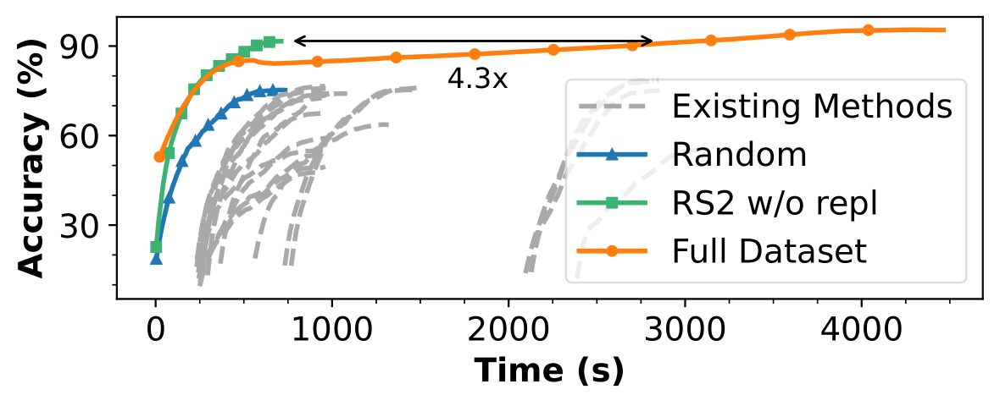
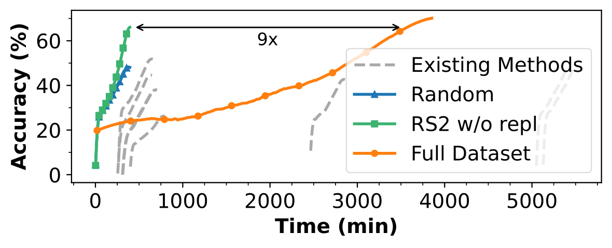

# Repeated Random Sampling for Minimizing the Time-to-Accuracy of Learning ([PDF](https://openreview.net/pdf?id=JnRStoIuTe))


## Requirements

To create a conda environment:
```setup
conda create -n rs2_env python=3.9
conda activate rs2_env
```
To create a virtual environment:
```setup
python -m venv rs2_env
source rs2_env/bin/activate
```

To install requirements:

```setup
pip install -r requirements.txt
```

_Note_: the above installation has been tested using _Python 3.9.16_ on Linux machines running _Ubuntu 20.04.6 LTS_. It’s 
possible some errors may arise on other platforms. For example, we 
found it necessary to downgrade _urllib3_ from version _2.0.2_ to _1.26.16_ on some Mac machines. 
See [link1](https://github.com/urllib3/urllib3/issues/2168) and 
[link2](https://github.com/invoke-ai/InvokeAI/issues/3358) 
for more details regarding this issue.

### Datasets
More details about downloading and preparing the datasets can be found: [here](data/README.md).

## Running The Code
Running RS2 w/o replacement on CIFAR10 using ResNet18 for 200 epochs:
```train
python src/DeepCore/main.py --data_path "data/" --dataset "CIFAR10" --n-class 10 --model "ResNet18" --selection "UniformNoReplacement" --epochs 200 --batch-size 128 --fraction 0.1 --per_epoch "True" 
```
In order to train on a static subset each epoch, the parameter `--per_epoch` should be set to `False`.

We support training on standard datasets by changing the `--dataset` parameter to:
`CIFAR10`, `CIFAR100`, `ImageNet30`, `ImageNet`, `TinyImageNet`. Paramater `--n-class` should be set to the number of
different classes for the chosen dataset.

Parameter `--selection` defines which method will be used for selecting the subsets. Some of the possible methods are:
`Forgetting`, `Herding`, `Craig`, `Uniform`, etc. For a complete list take a look at the names of imported classes: 
[here](src/DeepCore/deepcore/methods/__init__.py).

`fraction` represents the selection ratio _r_, i.e., the percentage of data that will be used per round.

For details about the hyperparameters, and how to change them take a look at [`arguments.py`](src/DeepCore/arguments.py).


## Reproducing the Paper Experiments

We provide scripts for running experiments with and without Slurm.
The hyperparameters used to produce the results reported in the paper are set in the corresponding scripts. For details about the hyperparameters, and how to change them take a look at [`arguments.py`](src/DeepCore/arguments.py).

Before executing files from `scripts/` move them to the main folder.
```train
mv scripts/<script_name> .
```

Running time-to-accuracy for CIFAR-10:
```train
source run_timeToAcc_cifar10.sh
```

Running time-to-accuracy for ImageNet-1k:
```train
source run_timeToAcc_imagenet.sh
```

Running robustness experiments on CIFAR-10 with label noise:
```train
source run_robustness_experiments.sh
```

Running dataset distillation experiments:
```train
source run_dataset_distillation.sh
```

Running per-round sampling experiments on CIFAR-10
```train
source run_perround_experiments.sh
```

### Analyzing ouptut files
More details about analyzing the output files can be found [here](outputs/README.md).

## Results


### Time-to-accuracy
CIFAR-10          |  ImageNet-1k
:-------------------------:|:-------------------------:
  |  


## Citation
```
@inproceedings{
    okanovic2024repeated,
    title     = {Repeated Random Sampling for Minimizing the Time-to-Accuracy of Learning},
    author    = {Patrik Okanovic and Roger Waleffe and Vasilis Mageirakos and Konstantinos Nikolakakis and Amin Karbasi and Dionysios Kalogerias and Nezihe Merve G{\"u}rel and Theodoros Rekatsinas},
    booktitle = {The Twelfth International Conference on Learning Representations},
    year      = {2024},
    url       = {https://openreview.net/forum?id=JnRStoIuTe}
}
```

## References

- Park, Dongmin, Dimitris Papailiopoulos, and Kangwook Lee. "Active Learning is a Strong Baseline for Data Subset Selection." Has it Trained Yet? NeurIPS 2022 Workshop [[code]](https://github.com/dongmean/AL_vs_SubsetSelection)
- Guo et al. DeepCore: A Comprehensive Library for Coreset Selection in Deep Learning,  2022. [[code]](https://github.com/PatrickZH/DeepCore)